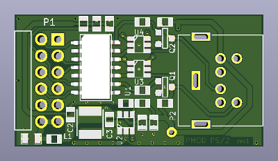
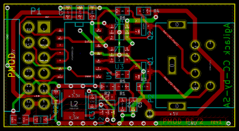

PS/2 interface PMOD
===================

This project is a small circuit (PMOD form factor) that allow to connect and
control a PS/2 device using an UART. On the PMOD side, pinout and signals use
the Type 3A specifications (UART).

